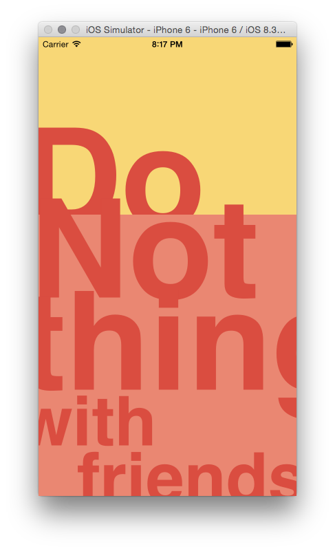

# do-nothing-with-friends-client

 

Let's you do nothing.

Install via 

```
git clone git@github.com:orta/do-nothing-with-friends-client.git
pod install
open "Do Nothing with Friends.xcworkspace"
```